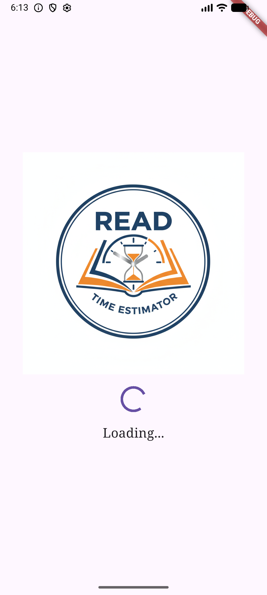
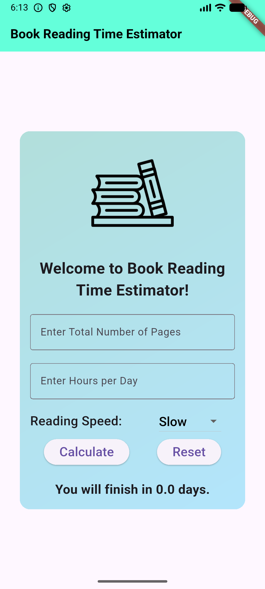
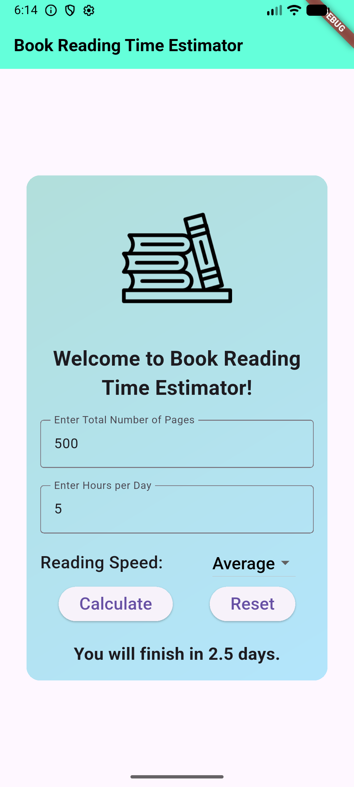

# book_reading_time_estimator

# Description 
The Book Reading Time Estimator is a Flutter based mobile application. It designed to help user/client to estimate how long it will take to read a book based on their habits. 

# IPO Process
1. User input the number of pages and hours per day
2. The app will calculate the estimated reading time
3. The app will display the estimated reading time

# Widget List Used
1. Scaffold
2. AppBar
3. Center
4. SingleChildScrollView
5. Container
6. Column
7. Row
8. Text
9. TextField
10. ElevatedButton
11. DropDownButton
12. SizedBox
13. SnackBar
14. setState()
15. Image.asset()
16. TextEditingController

# Validation 
1. Empty Input Check
2. Numeric Input Check
3. Positive Input Check
4. Error Feedback

# Authorship Note with signature 
Muhammad Fariz Irfan Bin Ghazale 302008
“I confirm that this project represents my own original work in accordance with academic integrity policies. No part of the code was fully generated by AI tools such as ChatGPT or GitHub Copilot. I relied solely on lecture notes, class tutorials, and official Flutter documentation. I understand that my work may be scrutinized, and if it is found that I did not personally develop the code, marks may be deducted, or the submission may be disqualified.”

# Screenshots
1. Splash Screen

2. Main Screen Before Calculation

3. Main Screen After Calculation
